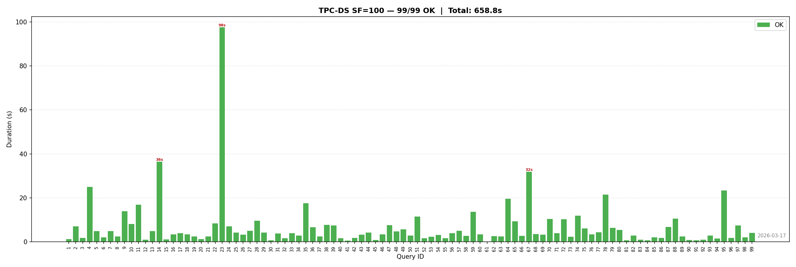

# tpcds — TPC-DS Benchmark for Apache Cloudberry / Greenplum

Run the full [TPC-DS v4](http://www.tpc.org/tpcds/) benchmark inside your MPP cluster — entirely from SQL, with a single command.

```sql
-- Install the extension in any database you like
CREATE EXTENSION tpcds;

-- That's it. One call does everything:
CALL tpcds.run(scale := 100, parallel := 4, storage_type := 'aocs');
```

This generates data **in parallel across all segments**, loads it via **one gpfdist per segment**, runs all **99 TPC-DS queries**, and records every result in the `tpcds` schema — all without leaving `psql`.

## Quick Start

```bash
# Build and install (requires gcc, pg_config on PATH)
make && make install

# Connect to any database and run
psql -p <port> -d <your_db> -c "CREATE EXTENSION tpcds;"
psql -p <port> -d <your_db> -c "CALL tpcds.run(100, 4, 'aocs');"
```

## Why This Extension

Traditional TPC-DS benchmarking on MPP databases requires juggling shell scripts, SSH, gpfdist setup, and manual query patching. This extension handles it all:

- **Data generation runs on every segment** — `dsdgen` is launched directly on segment hosts via `COPY TO PROGRAM + SSH`, with all workers batched into a single SSH call per host. No coordinator bottleneck.
- **One gpfdist per segment** — each segment runs its own gpfdist serving its local data directory. This maximizes I/O parallelism and avoids cross-segment network traffic.
- **Automatic query patching** — `dsqgen` output is automatically fixed for Cloudberry/Greenplum compatibility (date intervals, column aliases, GROUPING expressions, subquery naming, etc.).
- **All from SQL** — no external scripts to maintain. Every step is a SQL function call.

## Step-by-Step Usage

For more control, run each step individually:

```sql
-- 1. Create the 25 TPC-DS tables (heap / ao / aocs)
SELECT tpcds.gen_schema('aocs');

-- 2. Generate data on all segments
--    Args: scale_factor, parallel_per_segment
SELECT tpcds.gen_data(100, 4);

-- 3. Load data via gpfdist (one per segment, fully parallel)
--    Args: number of concurrent INSERT workers
SELECT tpcds.load_data(16);

-- 4. Generate the 99 TPC-DS queries
--    Scale defaults to gen_data's scale_factor; override if needed
SELECT tpcds.gen_query();

-- 5. Run the benchmark
SELECT tpcds.bench();

-- View results
SELECT tpcds.report();
SELECT * FROM tpcds.bench_summary ORDER BY query_id;

-- Generate a chart (requires python3, psycopg2, matplotlib)
SELECT tpcds.gen_chart();
```

### Example Chart (SF=100, Planner)



## Example: SF=1 End-to-End

```
$ psql -p 9000
=# CREATE EXTENSION tpcds;
WARNING:
  tpcds extension installed.
  Quick start:  CALL tpcds.run(scale := 1, parallel := 2, storage_type := 'aocs');

=# CALL tpcds.run(1, 1, 'aocs');
NOTICE:  run(): scale=1, parallel=1, storage_type=aocs, load_workers=16
NOTICE:  run(): step 1/5 — gen_schema(aocs)
NOTICE:  run(): step 2/5 — gen_data(1, 1)
NOTICE:  gen_data: SF=1, segments=32, parallel_per_seg=1, total_parallel=32
NOTICE:  gen_data: completed in 50.1 seconds
NOTICE:  run(): step 3/5 — load_data(16)
NOTICE:  load_data: launching 16 parallel workers
NOTICE:  run(): step 4/5 — gen_query(1)
NOTICE:  run(): step 5/5 — bench()
NOTICE:  [1/99] query 1: OK (359 ms)
...
NOTICE:  [99/99] query 99: OK (456 ms)
NOTICE:  === TPC-DS run complete in 201.0 sec ===
bench : Completed (ORCA): 99 OK, 0 errors in 104.0 sec

=# SELECT * FROM tpcds.bench_summary ORDER BY duration_ms DESC LIMIT 5;
 query_id | status | duration_ms | optimizer | scale_factor | storage_type
----------+--------+-------------+-----------+--------------+--------------
       14 |     OK |       10459 | ORCA      |            1 | aocs
       23 |     OK |        5910 | ORCA      |            1 | aocs
       64 |     OK |        6672 | ORCA      |            1 | aocs
       72 |     OK |        3140 | ORCA      |            1 | aocs
       85 |     OK |        2665 | ORCA      |            1 | aocs

=# SELECT tpcds.report();
                       report
----------------------------------------------------
 ("=== TPC-DS Benchmark Report ===","")
 (run_ts,"2026-03-06 16:37:16")
 (scale_factor,1)
 (storage_type,aocs)
 (optimizer,ORCA)
 (queries,"99 OK, 0 errors, 0 timeouts, 0 skipped")
 (total_time,"104.0 sec")

=# SELECT tpcds.clean_data();  -- remove .dat files from segments
```

## Data Cleanup

**Generated .dat files on segments are NOT automatically cleaned** after loading or benchmarking. At large scale factors they can consume significant disk space. Clean them explicitly:

```sql
-- Remove .dat files from all segment data directories
SELECT tpcds.clean_data();
```

To remove everything (tables, results, extension objects):

```sql
SELECT tpcds.clean_data();
DROP SCHEMA tpcds CASCADE;  -- drops the extension and all TPC-DS objects
```

Note: `DROP EXTENSION tpcds CASCADE` removes extension functions and internal tables, but leaves the `tpcds` schema behind. Use `DROP SCHEMA tpcds CASCADE` instead for a complete cleanup.

## Function Reference

### Pipeline

| Function | Description |
|---|---|
| `CALL tpcds.run(scale, parallel, storage_type, use_partition)` | Full end-to-end pipeline |
| `tpcds.gen_schema(storage_type, use_partition)` | Create 25 TPC-DS tables. `'heap'`, `'ao'`, or `'aocs'` |
| `tpcds.gen_data(scale_factor, parallel)` | Generate data on segments. `parallel` = dsdgen workers per segment |
| `tpcds.load_data(workers)` | Load via gpfdist. `workers` = concurrent INSERT sessions |
| `tpcds.gen_query(scale)` | Generate 99 queries with dsqgen |
| `tpcds.bench(optimizer, timeout_sec, skip)` | Run all queries. `optimizer`: `'orca'`/`'postgres'`. `skip`: query IDs to skip |

### Inspection & Reporting

| Function | Description |
|---|---|
| `tpcds.report()` | Text summary of latest benchmark run |
| `tpcds.gen_chart()` | Generate PNG bar chart and CSV export |
| `tpcds.show(qid)` | Display the SQL text of a query |
| `tpcds.exec(qid)` | Execute a single query and return timing |
| `tpcds.explain(qid, opts)` | Show query plan (e.g. `'ANALYZE, BUFFERS'`) |

### Configuration & Maintenance

| Function | Description |
|---|---|
| `tpcds.info()` | Show current configuration and paths |
| `tpcds.config(key, value)` | Get or set a config value |
| `tpcds.clean_data()` | Remove .dat files from all segment hosts |

### Result Tables

| Table | Description |
|---|---|
| `tpcds.bench_summary` | Latest benchmark run (overwritten each run) |
| `tpcds.bench_results` | Historical results (appended each run) |
| `tpcds.query` | Stored query texts |

## Configuration

Settings persist in `tpcds.conf` and survive `DROP/CREATE EXTENSION`:

```sql
SELECT tpcds.config('scale_factor', '300');
SELECT tpcds.config('storage_type', 'aocs');
```

| Key | Default | Description |
|---|---|---|
| `scale_factor` | `1` | TPC-DS scale factor (GB of raw data) |
| `parallel` | `2` | dsdgen workers per segment |
| `storage_type` | `aocs` | Table storage: `heap`, `ao`, `aocs` |
| `use_partition` | `false` | Range-partition fact tables by date |
| `workers` | `4` | Parallel INSERT workers for loading |
| `optimizer` | *(auto)* | Force `orca` or `postgres` for benchmark |
| `timeout_sec` | *(none)* | Per-query timeout in seconds |

Path settings (auto-detected, override if needed): `tpcds_dir`, `data_dir`, `query_dir`, `results_dir`, `tmp_dir`, `gpfdist_base_port`.

## How It Works

1. **gen_schema** — Creates all 25 TPC-DS tables with chosen storage type (heap/AO/AOCS with zstd compression). Optionally range-partitions large fact tables.

2. **gen_data** — Launches `dsdgen` on every segment host. All workers for a host are batched into a single shell script, sent via one SSH call — no sequential overhead. Each worker writes `.dat` files to its segment's local data directory.

3. **load_data** — Starts **one gpfdist per segment** (not per host), each serving its own data directory. Creates external tables pointing to all gpfdist instances. Runs parallel `INSERT INTO ... SELECT FROM` with configurable concurrency. Empty sentinel files are auto-created for small tables that only exist on certain segments.

4. **gen_query** — Runs `dsqgen` for all 99 templates and patches the output for Cloudberry compatibility.

5. **bench** — Executes all 99 queries sequentially, recording status, duration, row count, and optimizer per query.

## Prerequisites

- Apache Cloudberry (CBDB) or Greenplum 7+
- `pg_config` on `PATH`
- C compiler (`gcc`) for building DSGen tools
- SSH access from coordinator to all segment hosts (passwordless)
- For charts: `python3`, `psycopg2`, `matplotlib`

## HTTP_PROXY Warning

If your environment sets `HTTP_PROXY` / `http_proxy`, you **must** unset it before starting the cluster:

```bash
unset http_proxy https_proxy HTTP_PROXY HTTPS_PROXY
gpstart -a
```

Segment backends inherit the postmaster's environment. If proxy is set, all gpfdist connections will route through the proxy and fail with HTTP 502. The `load_data()` function detects this and will raise an error with instructions.

## License

The `tpcds` extension is released under the [Apache License 2.0](https://www.apache.org/licenses/LICENSE-2.0).

`DSGen-software-code-4.0.0/` contains TPC-DS tools from the [Transaction Processing Performance Council](http://www.tpc.org/), subject to the TPC EULA (see `DSGen-software-code-4.0.0/EULA.txt`).

**Disclaimer**: TPC Benchmark and TPC-DS are trademarks of the TPC. Results from this extension are not official TPC-DS results unless audited per the full specification.
